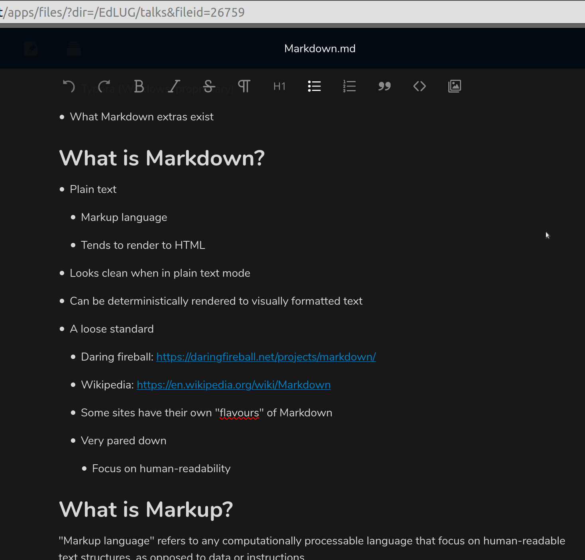

# Markdown for Beginners

* What is Markdown

* What is Markup

* What does Markdown look like

* Where have I seen it before

* Where is Markdown used

* What Markdown apps are available

  * Ghostwriter (FOSS)

  * Typora (Windows, proprietary)

* What Markdown extras exist

---

## What is Markdown?

* Plain text

  * Markup language

  * Tends to render to HTML

* Looks clean when in plain text mode

* Can be deterministically rendered to visually formatted text

* A loose standard

  * Daring fireball: <https://daringfireball.net/projects/markdown/>

  * Wikipedia: <https://en.wikipedia.org/wiki/Markdown>

  * Some sites have their own "flavours" of Markdown

  * Very pared down

    * Focus on human-readability

## What is Markup?

"Markup language" refers to any computationally processable language that focus on human-readable text structures, as opposed to data or instructions.

* JavaScript, Python and other "programming languages" are instruction languages

  * They express sequences of instructions

* CSV, XML, JSON and YAML are data languages

  * They express data in structures

* HTML, reStructuredText and Markdown are markup languages

  * They express content, and their organisation

* There are many other computing languages (CSS, SQL, XSLT, PostScript, SVG, MIDI->ABC, etc)

  * They do other stuff (yeah....)

## What does Markdown Look Like?

* In my text editor

* In GostWriter

* In Github

* In StackOverflow

* In NextCloud

* In Dev.to

---

## Where have I seen it before?

* If you used `*omg*` and it appeared as *omg*

* Many platform use a subset

  * `*` asterisk as a bullet point

  * or as emphasis markers

  * and for marking headers

* In fact, is based on and formalises old Internet practices already existing since the old chatrooms

## Where is Markdown used?

* StackOverflow

* Github/Gitlab

* Static Site Generators

  * Github site

* Dev.to blogging (Forem)

* My notes

## What apps are available?

* Windows: Typora (proprietary, free)

* Linux: GhostWriter (FOSS)

* Just your standard text editor or IDE

  * Visual Studio Code

  * Geany

  * Notead++ (just *not* Windows Notepad, please oh gods, no)

* Conversion libraries for programming languages

---

## Markdown extras

* Github - extra syntax highlighting

* Dev.to - headers

* Table creation

## Why use markdown

* Because you like it

* Makes text more readable

* Easier than HTML.

* Easier than LaTeX
